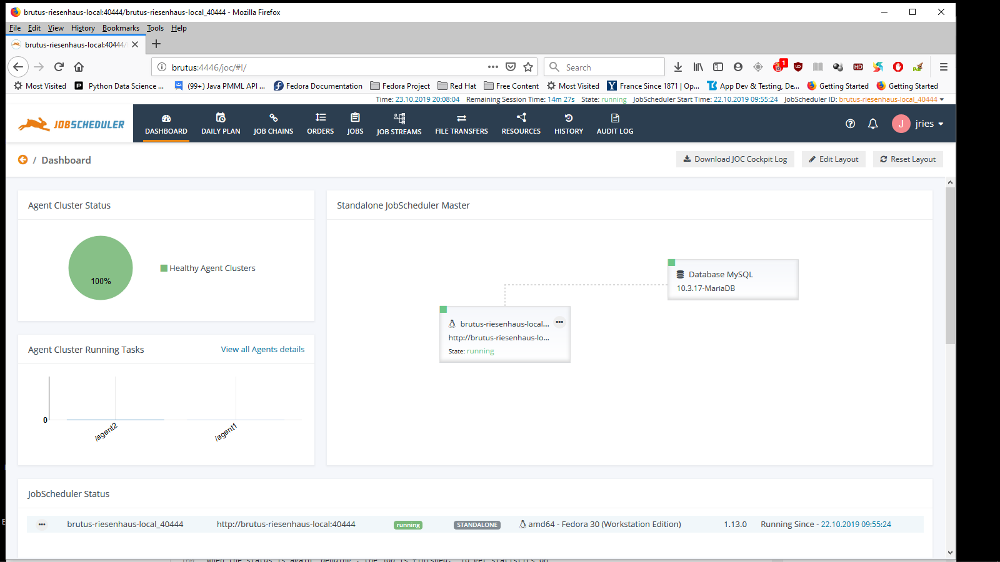
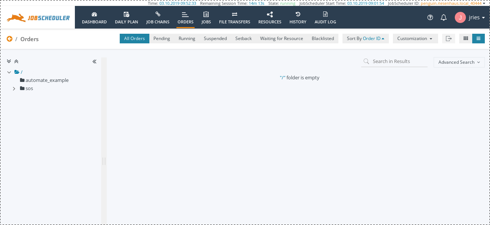
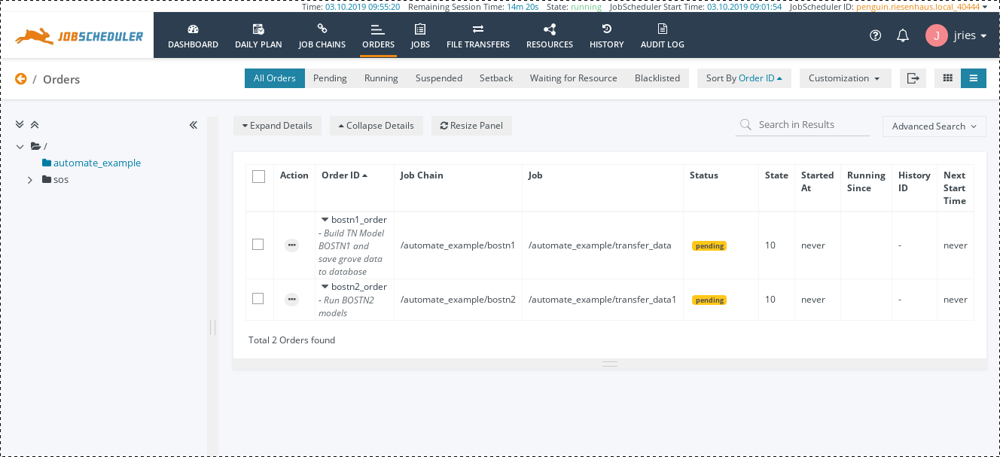

# Distributed-SPM
Facilitating the sharing of SPM jobs across multiple machines

## What are we trying to do here?
The goal is to create a system to allow the user to use Salford Predictive Modeler (SPM) to build batteries of predictive models on multiple machines in an automated fashion (in parallel) and then collect model settings, performance statistics, and other like data into a PostgreSQL database.

## How far have we gotten?
I have an example that will run six models on two machines residing in AWS and then send the aforesaid performance statistics and model settings to a Postgres database residing on a third AWS machine.  At the present time, this all happens under Linux, but in theory, it could happen on Windows as well, as will as any other computing platforms Minitab may choose to support in the future.

The instructions that follow are for Linux.  Thus far, the distributions employed have been Fedora, Ubuntu, and OpenSUSE.

## What is required?

* SPM 8.3 (non-GUI), available from [Salford Systems](https://www.salford-systems.com/products/spm).
* [JobScheduler 1.12.9](https://sourceforge.net/projects/jobscheduler/files/JobScheduler.1.12/JobScheduler.1.12.9/)
  You want the main program (jobscheduler_\*), and the JOC Cockpit (joc_\*).
* [SPM Model Database](https://github.com/jlries61/SPM_Model_Database)
* [JobScheduler Universal Agent](https://www.sos-berlin.com/jobscheduler-downloads)
* The [Java Development Kit](https://www.java.com/en/), version 8 or higher [OpenJDK](https://openjdk.java.net/install/) works fine and probably comes with your Linux distro.
* [Perl](https://www.perl.org/)
* An FTP server.  I've been using [vsftpd](https://security.appspot.com/vsftpd.html).
* A supported relational database system to work with JobScheduler.  I have been using MariaDB, but PostgreSQL should work as well.
* A modern, standard web browser (I have been using Firefox).
* libcanberra-gtk (name will vary somewhat, depending on the distro).

## How to prepare the master machine

These instructions are Linux specific, but the principles will be similar under Windows.  An X display is required to install JobScheduler and JOC Cockpit.

1. If it is not already installed, install the JDK.

2. Install and configure the MariaDB server.  Run `sudo mysql` and enter the following commands:
```
> ALTER USER 'root'@'localhost' IDENTIFIED WITH mysql_native_password BY ' <password> ';
> FLUSH PRIVILEGES;
> set @wait_timeout = 31536000;
> CREATE DATABASE scheduler;
> USE scheduler;
> exit
```
`<password>` is the password for the root role, as previous entered when configuring the server.

3. Install JobScheduler by extracting the archive and running `setup.sh` in `jobscheduler.1.12.9`.  Do not run it as root.  If the script fails because it fails to connect to the X server (a problem I have had repeatedly), run Java directly.  The command will be displayed by the script and will look something like this:
  ```
  sudo  "java" -jar "./jobscheduler_linux-x64.1.12.9.jar"
  ```
  After entering your password, the GUI will appear and you will be able to install.  On step 8, change the value for *Allowed Host* to 0.0.0.0.  On step 13, set the host to 127.0.0.1 (localhost), the user to "root" and the password to the previously set password for the root role.

4. Enable JobScheduler to run as a service.  The startup script is`/opt/sos-berlin.com/jobscheduler/ <hostname> _40444/bin/jobscheduler.sh`.  Copy it into `/etc/init.d`, removing the `.sh` extension.  If one is running SysVInit (traditional Linux `init`) then one can simply add the usual links to the usual `rc?.d` directories.  If instead one is running `systemd` (as most modern Linux distributions now do), then you will need to add it as a service there.  Under Debian and such derivatives as Ubuntu, one can run the following command from `/etc/init.d`:
  ```
  sudo update-rc.d jobscheduler defaults
  ```
  Otherwise, one can run the following command:
  ```
  sudo systemctl start jobscheduler
  ```
  And `systemd` will automatically incorporate the new service before launching it.
  
5. Install the JOC Cockpit in the same manner as the JobScheduler.  On step 6, set *Host* to 127.0.0.1, *Database* to "scheduler", and username and password the same as for JobScheduler.

6. Reboot the machine.

7. Assuming all has gone well, you should be able to point your browser to `http://localhost:4446` and log in as root (lame default password is "root").  Change the password to something reasonable and while you're at it, create a non-privileged account to do work from (and give it a decent password too).

## Configuring the Slave Machines

1.  Install all software required by SPM Model Database, except for the PostgreSQL server (install the client instead).  Install `addgrv` to a directory in the path such as `/usr/local/bin`.

2.  Install the JDK.

3.  Unpack the agent archive.  Move the directory `jobscheduler_agent` to the home directory of the account from which the agent will be run and rename it to `jos`.

4.  Copy `sos_jos.sh` (in the root of this repository) to `/etc/init.d`.  Modify the script, as necessary, by setting `USER` to the name of the unprivileged account that will run the agent.

5.  Make `sos_jos` a service in the same manner described for the JobScheduler server.

6.  Reboot the machine.

7.  Assuming all has gone well, the agent will be running.  To check (assuming you are running `systemd`), type:
```
systemctl status sos_jos
```
If it isn't, try starting it manually, like so:
```
sudo systemctl start sos_jos
```
Then check again.

## Configuring the Database Server

Normally, this will be the same as the master machine, but may be separate.  The slave machines need to be able to write to it, which may not be possible if the master is on your local network behind a firewall and the slave machines are not.

1.  Install the PostgreSQL server.  The exact package will vary depending on the Linux distribution employed.

1.  As the PostgreSQL user (usually `postgres`), create the role that will own the databsase (`john` in our example).  This can be done with the `createuser` utility, or in the `psql` interpreter with the `CREATE USER` command.

1.  In `postgresql.conf`, set `listen_address` to whatever addresses should be listening for database connections.  By default, PostgreSQL will only listen for connections originating on the local machine.

1.  If the username on the slave machines does not match the name of the Postgres account that owns the database, a mapping will need to be created in `pg_ident.conf`.  In our current example, we have:
```
# MAPNAME       SYSTEM-USERNAME         PG-USERNAME
agent           jobscheduler            john
```

1.  Each client machine must be entered into `pg_hba.conf`.  Here are mine:
```
host     all             all             52.162.218.151/32 ident map=agent
host     all             all             168.62.104.141/32 ident map=agent
```

I chose to use `ident` as the authentication protocol, but there are other options that might work better for you.  If you use it, then make sure that an `ident` service is installed and running on each client machine.  See the Postgres documentation for configuration details.  The raw IP addresses are used because it appears that Azure does not support reverse DNS.

1.  As the user created to own the model database, create it (`spm` in our example).  This can be done with the `createdb` utility or in `psql` with the `CREATE DATABASE` command.
  
1.  Test your configuration by trying to log in to the database from each of the slave machines, using the `psql` utility.  Something like the following should work:
```
psql -h <hostname> -U <username> -d spm
```
If you get a prompt without error messages, it works.  Exit with the `\q` command.

## Running the Example

### Installing the SPM files

Copy the contents of `Example/automate` in this repository to your home directory on the master machine.

### Installing the JobScheduler configuration files

Copy the contents of `Example/JOS-Config/automate_example` to `/opt/sos-berlin.com/jobscheduler/ <hostname> _40444/config/live`.

Edit the following configuration files, replacing the existing hostnames with yours:

In `Example/JOS-Config`:
* agent1.process_class.xml
* agent2.process_class.xml

In both cases, change the value of `remote_scheduler` to the name or IP address of the appropriate slave machine.

In `Example/JOS-Config/automate_example`:
* transfer_cmd1.job.xml
* transfer_cmd2.job.xml
* transfer_data1.job.xml
* transfer_data2.job.xml

In all four cases, change the value of `target_host` to the name or IP address of the appropriate slave machine.  Use the name specified in `agent1.process_class.xml` in `transfer_cmd1.job.xml` and `transfer_cmd2.job.xml`.  Use the name specified in `agent2.process_class.xml` in `transfer_data1.job.xml` and `transfer_data2.job.xml`.  Also, change the usernames and passwords to the ones you are actually using.

# Running the example

With your web browser, log into https://localhost:4446.  Assuming all is
well, you will see something like this:



Click on "Orders" and you will see:



Now, click on "automate_example".  You will see:



Now, click on the elipsis next to "bostn2_order":


