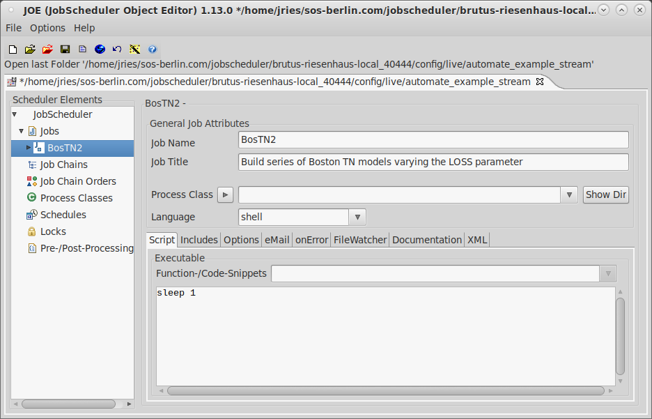
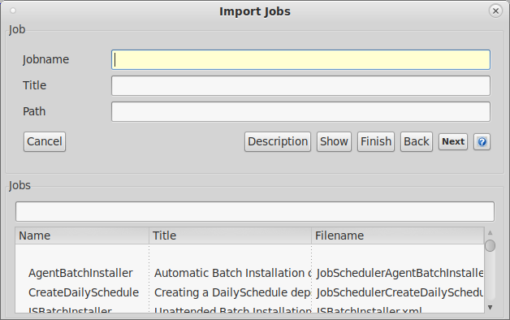
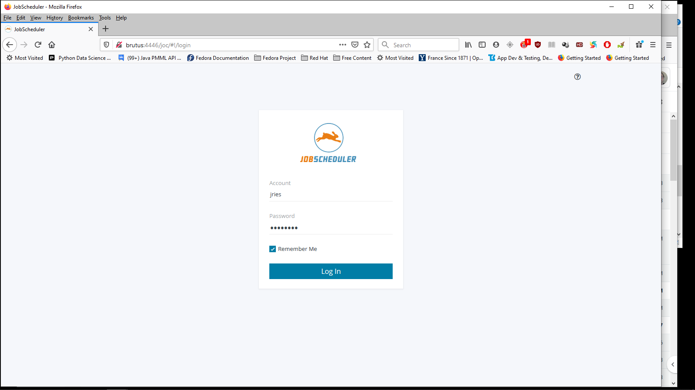
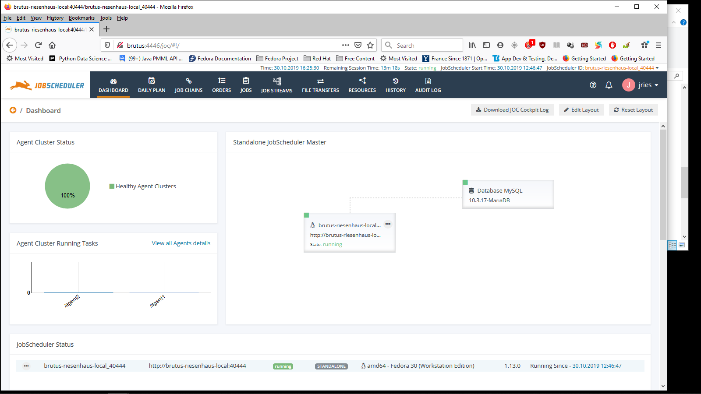
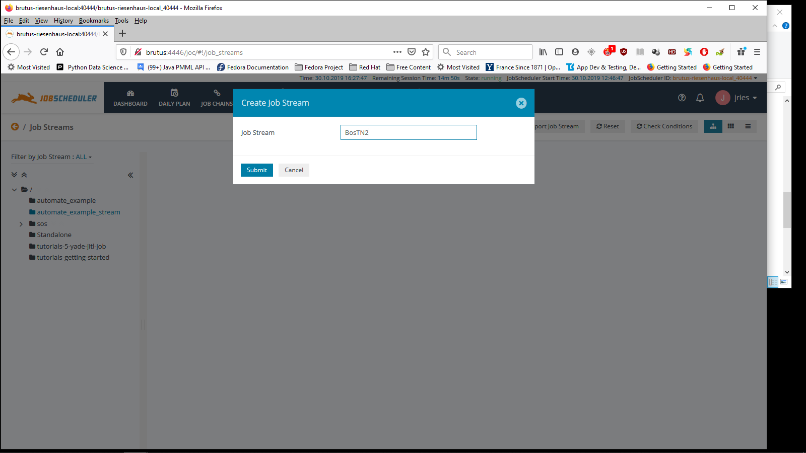
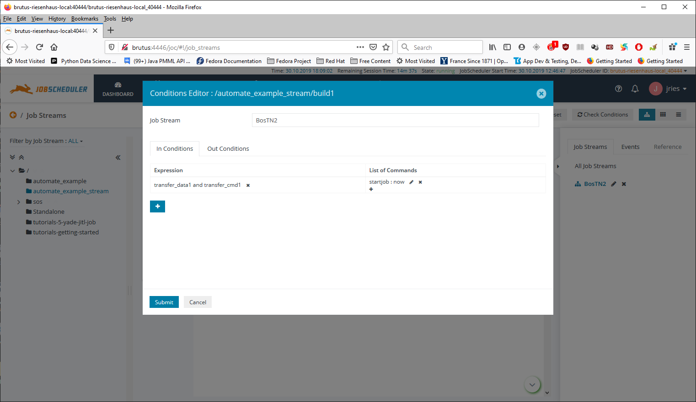

# How to set up a distributed SPM job with JobScheduler

JobScheduler's job stream feature is useful for the purpose, but sorry to say, it is not entirely intuitive, so I will explain the process here.  What is envisioned is that there will be a set of command files assigned to each host machine, one or more datasets used by those jobs, and optionally, a common set of submit files for purposes of repetitive code avoidance.  In the examples included with this project, we start with a root directory with three subdirectories: `cmd`, `data`, and `results`; but individual tastes may vary.  In `cmd`, we see:
```
bostn1.cmd        bostn2_HUBER.cmd  bostn2_RF.cmd       FPATH.CMD
bostn2_GAMMA.cmd  bostn2_LAD.cmd    bostn2_TWEEDIE.cmd  LABELS.CMD
bostn2gen3.sh     bostn2_LS.cmd     bostn2.txt
```

The template command file is `bostn2.txt` and reads as follows:
```
submit fpath
output bostn2_LOSSFUNC
grove bostn2_LOSSFUNC
memo "Basic TN model on the Boston housing data"
memo "LOSS=LOSSFUNC"
memo echo
use boston
submit labels
category chas
model mv
treenet loss=LOSSFUNC go
```

`LOSSFUNC` is a placeholder that will be replaced by various loss function names.  The command files we will generate will call two submit files.  The first, `FPATH.CMD`, specifies the directory structure for the project.  In our example, it reads as follows:
```
fpath "../data" /use
fpath "../results" /grove
fpath "../results" /output
```

After the file is "submitted", SPM will automatically search for input datasets in `../data` and write grove and output files in `../results`.

`LABELS.CMD` defines field and class labels for fields in the input dataset, `BOSTON.CSV`.  It reads as follows:
```
label crim="Per capita crime rate by town"
label zn="Proportion of residential land zoned for lots over 25,000 sq.ft."
label indus="Proportion of non-retail business acres per town"
label chas="Tract bounds Charles River?"
class chas 0="No" 1="Yes"
label nox="Nitric oxides concentration (parts per 10 million)"
label rm="Average number of rooms per dwelling"
label age="Proportion of owner-occupied units built prior to 1940"
label dis="Weighted distances to five Boston employment centres"
label rad="Index of accessibility to radial highways"
label tax="Full-value property-tax rate per $10,000"
label pt="Pupil-teacher ratio by town"
label b="1000(Bk - 0.63)^2 where Bk is the proportion of blacks by town"
label lstat="% lower status of the population"
label mv="Median value of owner-occupied homes in $1000's"
```

These labels will show up in the grove files produced and are useful for documentation purposes.

The directory `data` contains a single file, `BOSTON.CSV`, which is the input dataset.

It should be noted that SPM automatically converts unquoted file names to upper case.  This is not an issue under Windows, where file names are case insensitive, except for purposes of display; but is usually an issue under UNIX-like systems such as Linux and MacOS X.  For this reason, it is recommended that the names of `SUBMIT` files and CSV datasets be upper case, as they are in this example. If they are lower or mixed case, then they need to be quoted (extension included).  Thus, if one were to read `boston.csv`, the `USE` statement would read as follows:
```
use "boston.csv"
```

It is also easier to distinguish `SUBMIT` files intended to be called from other files from stand-alone command files if the names of the first are upper case (`*.CMD`) and those of the second are lower case (`*.cmd`).

## Generating the Command Files

In our example directory (see above), one of the files is `bostn2gen3.sh`.  It reads as follows:
```
#!/bin/sh
SUBMITS="FPATH.CMD LABELS.CMD"
N=2

scmdgen --input=bostn2.txt --baseout=bostn2 --use_values \
        LOSSFUNC=LAD,LS,HUBER,RF,GAMMA,TWEEDIE
let i=0
for file in bostn2*.cmd; do
  if [ $i -ge $N ]; then
    let i=0
  fi
  let i=$i+1
  cp -p $file ../cmd$i/
done
for dir in ../cmd[1-$N]; do
  cp -p $SUBMITS $dir
done
```

The above example, uses the [Small Command Generator (scmdgen)](https://github.com/jlries61/scmdgen) to create a command file to build each of the six variant models.

The command files produced are `bostn2_*.cmd` as follows:
```
bostn2_GAMMA.cmd  bostn2_LAD.cmd  bostn2_RF.cmd
bostn2_HUBER.cmd  bostn2_LS.cmd   bostn2_TWEEDIE.cmd
```
The contents of `bostn2_GAMMA.cmd` are as follows:
```
submit fpath
output bostn2_GAMMA
grove bostn2_GAMMA
memo "Basic TN model on the Boston housing data"
memo "LOSS=GAMMA"
memo echo
use boston
submit labels
category chas
model mv
treenet loss=GAMMA go
```
Finally, the command files generated are distributed between `../cmd1` and `../cmd2` and all of the submit files are written to both directories.

## Setting up the Job Stream

The steps that JobScheduler needs to take are as follows:

1.  Transfer the input dataset to the agent machines if they are not
    already present.
1.  Copy the appropriate command files to each of the agent machines.
1.  Build the requested models
1.  Write the model performance stats to the PostgreSQL database.
1.  (optional) Generate a report of the models built.

### Creating the jobs

The [JobScheduler Object Editor (JOE)](https://kb.sos-berlin.com/display/PKB/JOE+-+JobScheduler+Object+Editor) is distributed with JobScheduler and provides a graphical user interface for creating and editing jobs, job chains, and orders.  Assuming that JobScheduler's `bin` directory is in the path, then it can be invoked under UNIX-like systems as follows:
```
jobeditor.sh
```
Under Linux, the directory is, by default, /opt/sos-berlin.com/jobscheduler/<installation name>/bin.  On my main machine, it is /opt/sos-berlin.com/jobscheduler/brutus-riesenhaus-local_40444/bin.

JOE's opening screen looks something like this:


Click the red folder in the toolbar and you will be prompted to open a "hot folder".


Click on the "New Folder" button and create a new folder "automate_example_stream".


Now, hit Enter and click on "OK".


Click on "Jobs"...


...and click on "New Standalone job".


Select "job1" in the left menu panel.


Now fill in the dialogue for the initial job.  The sole purpose of this one is to start the process, so all it will do is to sleep for one second.  After you have filled in the definition, you can click on the disk icon to save the current status.



Click on "Jobs" and then on "Wizards".  We then see the "Import Jobs" dialogue.



The intent here is to define a job to copy the contents of the Data directory to the first agent, so we select "YADE-Job" as the job template and fill in the other blank spaces.


Now, click on "Next".


From here, we set the appropriate parameters for the job.


Your mileage may vary, but here we set reasonable settings for the transfer.

Be warned that FTP may have firewall issues (but my efforts to use SFTP with YADE have thus far failed miserably).  The password shown comes from L. Frank Baum's "The Magic of Oz" and is not the real one.

Click on "next", and we get:


I chose to do this single threaded.  Click on "Finish", since the rest of these are not really relevant.


Now we're back to the original dialogue with a new job added.  Double-click on it.


We don't need to do any more with this, so we go on to the next job.  Go back to the Jobs dialogue, click on "Wizard", configure the new job as stand-alone, and again use "YADE-Job" as the template.  Configure as below:


Click on "Next".  We will then proceed the job in much the same way as the previous one, but the source and target directories will change and we will always overwrite existing files (command files are smaller).


Proceed with the creation of the job in the same manner as before.  We will then have three jobs configured.


We then create "transfer_data2" in exactly the same manner as "transfer_data1", except that the target host is the second agent instead of the first.


Then we create "transfer_cmd2" in the same manner as "transfer_cmd1", but we transfer the data from cmd2 to the second agent.


Now we get to create the model building jobs, "build1" and "build2".  They look exactly the same, except that they run on different hosts.  But first, we need to define agents, which we will do now, so click on "Process Classes" and fill in the form, like so:


Click on "Apply Host" to add the agent URL to the list.


Click on "Apply" to save the class.


Now add agent2 following the same procedure.


Now go back to Jobs and click on "New Standalone Job".  Then double click on "job1" and fill in the dialogue.


The procedure is to change to the `cmd` directory, create an `archives` subdirectory, execute all of the command files, and then write the performance and settings data to the database.

But since this is all parameterized, we need to define some environment
variables, which we do by expanding "build1" selecting "Parameters", and then selecting the "Environment" tab.


Now we create build2 by copying and modifying build1.  Right-click on "build1", select "Copy" then select "Paste".


We then change the name to "build2" and set the process class to agent2.  Those are the only changes required here.


We would create an additional set of jobs for each agent on which we would be building models.

The last job to create is the one to report the models run.


Make sure you save your work by clicking on the disk item.  Then we can proceed to define the job stream.

You can now close JOE.

### Configuring the Job Stream

The job stream is configured in the web interface and is stored in the database.  Assuming JobScheduler and JOC are configured as described in the readme, open JOC (port 4446) in your preferred browser.  You should see something like this:



Login and click on the three line icon as shown.



Click on "JOB STREAMS", then navigate to "automate_example_stream".  Then click
on the tree icon.  You should see something like this:


Click on "Click here to add".



Fill in the name and click on "Submit".


Drag the block labeled "BosTN2" onto the main part of the display.


The Conditions Editor displays.  Since is the first job, we will not be defining any "In Conditions", but will define an "Out Condition".  Accordingly, click on "Out Conditions".


Click on "Click here to add".


The default is what we want.  Click on "Save".  What it amounts to is a request
to create the event "BosTN2" if the job runs successfully.


The resulting display shows the one condition, which is the only one we need.
Click on "Submit".


The "BosTN2" block is now in place.  Now we put the "transfer" jobs in place.  The current display makes it hard to determine which job is which, so change to the "Compact View" by clicking on the icon just to the right of the tree icon.


We will start with "transfer_data1".  Click on the elipsis to bring up the appropriate menu.


Now, click on "Edit Conditions" to bring up the Conditions Editor.


We need an in condition this time, so click on "Click here to add".


The in condition will "BosTN2", which is the prerequisite for this job.  Click on "Save".


Now, click on "Out Conditions" and define the out condition in the same manner as for the previous job.


Now click on "Submit" to finalize the conditions for this job.  After switching back to the tree view, we see:


Next, put the other three transfer jobs under "BosTN2" in the same way.


Now, put "build1" in place.  This time, the in condition is "transfer_data1 and "transfer_cmd1".



Once the conditions are defined, the diagram looks like this:


Put "build2" in place, making it dependent on "transfer_data2" and "transfer_cmd2".


Put "modstats" in place, making it dependent on "build1" and "build2".


We are now ready to run.  Click on "Start Task Now" on the top menu and things should run as shown in the readme.


