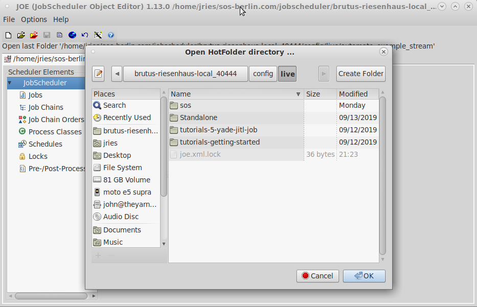

# How to set up a distributed SPM job with JobScheduler

JobScheduler's job stream feature is useful for the purpose, but sorry to say,
it is not entirely intuitive, so I will explain the process here.  What is
envisioned is that there will be a set of command files assigned to each host
machine, one or more datasets used by those jobs, and optionally, a common
set of submit files for purposes of repetitive code avoidance.  In the examples
included with this project, we start with a root directory with three
subdirectories: `cmd`, `data`, and `results`; but individual tastes may vary.
In `cmd`, we see:
```
bostn1.cmd        bostn2gen.ksh     bostn2_LS.cmd       bostn2.txt
bostn2_GAMMA.cmd  bostn2_HUBER.cmd  bostn2_RF.cmd       FPATH.CMD
bostn2gen2.ksh    bostn2_LAD.cmd    bostn2_TWEEDIE.cmd  LABELS.CMD
```

The template command file is `bostn2.txt` and reads as follows:
```
submit fpath
output bostn2_LOSSFUNC
grove bostn2_LOSSFUNC
memo "Basic TN model on the Boston housing data"
memo "LOSS=LOSSFUNC"
memo echo
use boston
submit labels
category chas
model mv
treenet loss=LOSSFUNC go
```

`LOSSFUNC` is a placeholder that will be replaced by various loss function
names.  The command files we will generate will call two submit files.  The
first, `FPATH.CMD`, specifies the directory structure for the project.  In our
example, it reads as follows:
```
fpath "../data" /use
fpath "../results" /grove
fpath "../results" /output
```

After the file is "submitted", SPM will automatically search for input datasets
in `../data` and write grove and output files in `../results`.

`LABELS.CMD` defines field and class labels for fields in the input dataset,
`BOSTON.CSV`.  It reads as follows:
```
label crim="Per capita crime rate by town"
label zn="Proportion of residential land zoned for lots over 25,000 sq.ft."
label indus="Proportion of non-retail business acres per town"
label chas="Tract bounds Charles River?"
class chas 0="No" 1="Yes"
label nox="Nitric oxides concentration (parts per 10 million)"
label rm="Average number of rooms per dwelling"
label age="Proportion of owner-occupied units built prior to 1940"
label dis="Weighted distances to five Boston employment centres"
label rad="Index of accessibility to radial highways"
label tax="Full-value property-tax rate per $10,000"
label pt="Pupil-teacher ratio by town"
label b="1000(Bk - 0.63)^2 where Bk is the proportion of blacks by town"
label lstat="% lower status of the population"
label mv="Median value of owner-occupied homes in $1000's"
```

These labels will show up in the grove files produced and are useful for
documentation purposes.

The directory `data` contains a single file, `BOSTON.CSV`, which is the
input dataset.

It should be noted that SPM automatically converts unquoted file names
to upper case.  This is not an issue under Windows, where file names are case
insensitive, except for purposes of display; but is usually an issue under
UNIX-like systems such as Linux and MacOS X.  For this reason, it is
recommended that the names of `SUBMIT` files and CSV datasets be upper case, as
they are in this example. If they are lower or mixed case, then they need
to be quoted (extension included).  Thus, if one were to read `boston.csv`,
the `USE` statement would read as follows:
```
use "boston.csv"
```

It is also easier to distinguish `SUBMIT` files intended to be called from
other files from stand-alone command files if the names of the first are
upper case (`*.CMD`) and those of the second are lower case (`*.cmd`).

## Generating the Command Files

In our example directory (see above), one of the files is `bostn2gen2.ksh`.
It reads as follows:
```
#!/bin/ksh
SUBMITS="FPATH.CMD LABEL.CMD"
N=2
genmany3 -s -b bostn2_ -s bostn2.txt LOSSFUNC LAD LS HUBER RF GAMMA TWEEDIE
let i=0
for file in bostn2*.cmd; do
  if [[ $i -ge $N ]]; then
    let i=0
  fi
  let i=$i+1
  cp -p $file ../cmd$i/
done
for dir in ../cmd[1-$N]; do
  cp -p $SUBMITS $dir
done
```

`genmany3` is a shell script I wrote, but do not have authority to
distribute (Minitab, which bought my former employer, holds the copyright).
It is my intent to write a replacement in due course, but what it does is to
replace one or more strings ("tokens") in the source command files with one or
more specified strings, thus producing either a stream of commands (which can
be fed to SPM), or multiple command files, which is what we do here.

The command files produced are `bostn2_*.cmd` as follows:
```
bostn2_GAMMA.cmd  bostn2_LAD.cmd  bostn2_RF.cmd
bostn2_HUBER.cmd  bostn2_LS.cmd   bostn2_TWEEDIE.cmd
```
The contents of `bostn2_GAMMA.cmd` are as follows:
```
submit fpath
output bostn2_GAMMA
grove bostn2_GAMMA
memo "Basic TN model on the Boston housing data"
memo "LOSS=GAMMA"
memo echo
use boston
submit labels
category chas
model mv
treenet loss=GAMMA go
```
Finally, the command files generated are distributed between `../cmd1` and
`../cmd2` and all of the submit files are written to both directories.

## Setting up the Job Stream

The steps that JobScheduler needs to take are as follows:

1.  Transfer the input dataset to the agent machines if they are not
    already present.
1.  Copy the appropriate command files to each of the agent machines.
1.  Build the requested models
1.  Write the model performance stats to the PostgreSQL database.
1.  (optional) Generate a report of the models built.

### Creating the jobs

The [JobScheduler Object Editor (JOE)](https://kb.sos-berlin.com/display/PKB/JOE+-+JobScheduler+Object+Editor) is distributed with JobScheduler and provides
a graphical user interface for creating and editing jobs, job chains, and
orders.  Assuming that JobScheduler's `bin` directory is in the path, then it
can be invoked under UNIX-like systems as follows:
```
jobeditor.sh
```
Under Linux, the directory is, by default, /opt/sos-berlin.com/jobscheduler/<installation name>/bin.
On my main machine, it is /opt/sos-berlin.com/jobscheduler/brutus-riesenhaus-local_40444/bin.

JOE's opening screen looks something like this:


Click the red folder in the toolbar and you will be prompted to open a
"hot folder".


Click on the "New Folder" button and create a new folder
"automate_example_stream".



Now,
